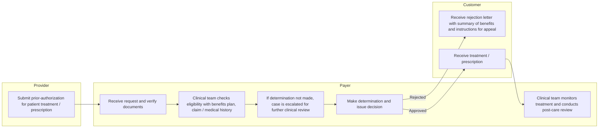
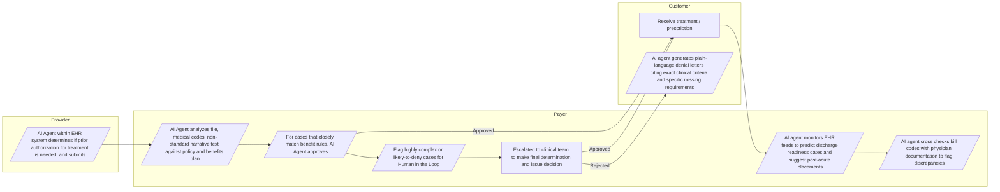

# Prior Authorization Demo — Presentation Slides

> **Purpose:** Slide-by-slide source for a PowerPoint deck on the AI-enabled prior-authorization use case. Written so Claude can convert it into `.pptx` without further interpretation.
>
> **Sources (only these — nothing else was used):**
> - `507-510-project-kickoff.md` — BCBS VT / Accelare kickoff deck (slides 12–15 for EPM, current/future swimlanes, risk-to-governance).
> - `prior-auth-plan.md` — demo plan and decisions.
> - `frontend/src/lib/priorAuthFlows.ts` — swimlane step text (verbatim from kickoff slides 13–14).
> - `frontend/src/lib/priorAuthDemo.ts` — the 3 simulated cases (manual and AI-enabled walkthroughs, timings, notices).
> - `frontend/src/pages/prior/*.tsx` — `/prior` and `/prior/simulate` pages (on-screen safeguard statements).
> - `frontend/src/lib/priorAuthIntegrity.ts`, `frontend/src/lib/priorAuthFairnessData.ts`, `frontend/src/pages/clinician/PriorAuthDemo.tsx` — controls built on the clinician prior-auth packet page.
> - `old demo docs/agents/agents.md`, `old demo docs/output_integrity.md`, `old demo docs/governance_usecase.md` — Agent 5 charter and AICT/AIRC registration.
>
> **Conventions for the PPT build:**
> - One `## Slide N` heading = one slide. `**Title:**` is the slide title. `**Layout:**` is a hint for the slide layout.
> - `Speaker notes` blocks go in the PowerPoint notes pane, not on the slide.
> - All timings and case facts are from the **frontend-only simulation with fictitious data**. Every slide that shows them carries the label *"Illustrative simulation — fictitious data"*. No external industry statistics are used anywhere in this deck.
> - `[PRESENTER]` and `[FILL FROM CPRM REGISTER]` are placeholders to be completed by the author.
> - Colour conventions (from the demo design system): teal = AI-enabled / accent, amber = pending / human-in-the-loop, red = denial / risk, green = approval, dashed blue box = AI agent step.

---

## Slide 1 — Title

**Title:** AI-Enabled Prior Authorization — Track & Evaluate Clinical Utilization (EPM 5.5)

**Layout:** Title slide

- **Subtitle:** 507 AI Governance & Value Realization · 510 AI Safety, Security & Privacy — Prior Authorization use-case demonstration
- **Presenter:** [PRESENTER]
- **Date:** 2 September 2026
- **Footer:** BlueCross BlueShield of Vermont — with Accelare. *"An Independent Licensee of the Blue Cross and Blue Shield Association."*
- **Tag line (small, bottom):** Illustrative demonstration — frontend-only simulation, fictitious data, no PHI.

**Speaker notes:**
This deck walks the prior-authorization use case selected at the 507/510 kickoff from the enterprise process model down to a working simulation. We will show today's manual process, the AI-enabled future state, three simulated cases run both ways, and the risks and controls that govern the AI-enabled version.

---

## Slide 2 — Where this use case sits: EPM with heat assessment

**Title:** Enterprise Process Model — Process family 5, "Manage Affordability, Access & Care"

**Layout:** Left: table of process family 5 with heat colours. Right: callout box on 5.5.

**Source:** Kickoff slide 12 (EPM with heat Assessment). Process family 5 is a **red chevron** (one of the two hottest families; the other is family 2).

| Heat | Process |
|---|---|
| Red | 5.1 Align payment rules with business policies and industry standards |
| Red | 5.2 Formulate strategic cost-containment and payment-integrity models |
| Orange | 5.3 Manage medical costs & claims |
| Red | 5.4 Manage pharmacy costs & claims |
| **Red — HIGHLIGHTED** | **5.5 Track and evaluate clinical utilization** ← selected use case |
| Orange | 5.6 Coordinate longitudinal case interventions |
| Yellow | 5.7 Track and manage clinical quality and performance metrics |
| Orange | 5.8 Monitor and enforce payment rules |
| Orange | 5.9 Proactively detect and mitigate fraud, waste, and abuse |
| Red | 5.10 Settle fully insured financial accounts |
| Red | 5.11 Settle ASO financial accounts |
| Red | 5.12 Navigate Provider Availability |

**Callout box (teal border) on 5.5:**
- Selected use-case anchor for prior authorization.
- Heat: **Red** (hottest tier in the assessment).
- Related processes elsewhere in the EPM: 1.8 *Collaborate on clinical utilization and prior-authorization rule sets* (Orange) and 2.6 *Program clinical utilization and authorization rules* (Red).

**Heat legend (small):** Red = hottest · Orange · Yellow · Green · Gray = not assessed.

**Speaker notes:**
The kickoff EPM heat map rates every process. Process family 5 is one of the two red chevrons. Within it, 5.5 "Track and evaluate clinical utilization" is red and was called out as the anchor for the prior-authorization slides. Two adjacent processes, 1.8 and 2.6, own the rule sets that 5.5 applies, which is why the future state also touches the provider and payer rule engines.

---

## Slide 3 — What is prior authorization?

**Title:** What is prior authorization?

**Layout:** Definition on the left; three "who is involved" boxes on the right (Provider, Payer, Member).

**Definition (one paragraph):**
Prior authorization is the payer's review of a requested treatment, admission or prescription **before** it is delivered, to confirm that the member is eligible, the service is a covered benefit, and the request meets the plan's medical-necessity and level-of-care criteria. The outcome is an approval (an authorization number with approved units and validity dates) or an adverse determination (a denial notice with the criteria applied and appeal rights).

**Who is involved (three boxes, matching the swimlane lanes used in the kickoff):**
- **Provider** — decides treatment, determines that authorization is required, assembles the clinical packet, submits the request.
- **Payer** — receives and verifies the request, checks eligibility and benefits, applies clinical criteria, escalates complex cases to clinical reviewers, issues the determination, monitors post-care.
- **Customer (member)** — receives either the treatment / prescription or a rejection letter with appeal instructions.

**Key vocabulary used in the demo (small table):**

| Term | Meaning in this deck |
|---|---|
| X12 278 | The electronic authorization request / response transaction used in the AI-enabled simulation |
| Level-of-care criteria | The clinical criteria set applied to a request (e.g. IOP continued stay, acute inpatient admission, ASAM 3.5 residential) |
| TAT | Turnaround time. Simulation uses **72 hours** for standard and **24 hours** for expedited requests |
| HITL | Human in the loop — a licensed clinical reviewer makes the determination |
| Adverse determination | A denial. In the simulation, only a licensed clinical reviewer can issue one |

**Speaker notes:**
Prior authorization is a utilization-management gate that sits between a provider's treatment decision and the delivery of care. Three parties are always involved, and the kickoff swimlanes use exactly those lanes. The vocabulary on the right recurs throughout the simulation.

---

## Slide 4 — The important steps in prior authorization

**Title:** The six steps every prior authorization passes through

**Layout:** Six numbered chevrons left-to-right, with a one-line description under each. Colour step 5 amber (decision) and step 6 teal (post-care).

**Source:** Kickoff slide 13 (current state) — the step sequence is the same in both states; only the actor changes.

| # | Step | What happens | Owner (lane) |
|---|---|---|---|
| 1 | **Submit** | Provider submits a prior-authorization request for a patient treatment or prescription with supporting clinical documentation | Provider |
| 2 | **Receive & verify** | Payer receives the request and verifies the documents are complete | Payer |
| 3 | **Eligibility & benefits check** | Clinical team checks eligibility against the benefits plan and the claim / medical history | Payer |
| 4 | **Clinical review / escalation** | If a determination cannot be made, the case is escalated for further clinical review | Payer |
| 5 | **Determination & notice** | A determination is made and the decision issued: approved (member receives treatment) or rejected (member receives a rejection letter with summary of benefits and appeal instructions) | Payer → Customer |
| 6 | **Post-care monitoring** | Clinical team monitors treatment and conducts post-care review | Payer |

**Bottom banner:** Two clocks run across steps 2–5: **72 hours** (standard) or **24 hours** (expedited) from receipt to determination. Requests for additional information pause / extend the clock. *(Timings as used in the simulation.)*

**Speaker notes:**
These six steps come straight from the current-state swimlane in the kickoff deck. They do not change in the future state. What changes is who performs each step, how long it takes, and how much of the evidence is assembled automatically. Keep this slide in mind as the reference when we compare the two process flows.

---

## Slide 5 — Current state (manual) and its shortcomings

**Title:** Current state: a manual, document-chasing process

**Layout:** Left column "How it runs today" (5 bullets). Right column "Cons" (6 bullets, red accents). Footer label: *Illustrative simulation — fictitious data.*

**How it runs today (from kickoff slide 13 and the demo's manual walkthroughs):**
- Provider submits the request; in the demo this is **fax** (a printed plan form plus 22 pages of records) or an after-hours phone call to a voicemail plus fax.
- A UM intake coordinator **hand-keys** the request into the UM system the next business day and scans the fax into the document repository.
- A nurse reviewer pulls benefits, claims and imaged documents from **separate systems** and reads the notes.
- Missing documents trigger an **additional-information request** by fax / mail, which pauses the decision clock; the case waits in a queue for capacity.
- Determination is issued by phone / fax / mail; post-care review is **retrospective and sampled**.

**Cons (each observed in the manual simulation):**
- **Slow:** the clean IOP continuation took **6 days** to approve; the expedited inpatient admission was approved at **hour 23 of 24**; the residential SUD request was denied on **day 7**.
- **Rework:** a transposed member ID needed a phone call back to the clinic; medical-clearance labs needed two phone calls; peer-to-peer connected on the second attempt.
- **Documentation gaps discovered late:** nobody told the facility its ASAM packet was incomplete until a nurse opened the file on day 2.
- **Clock consumed by handling, not review:** seven hours of the 24-hour expedited window elapsed before the fax was picked up.
- **Care interrupted:** the member's first authorized IOP visit was rescheduled while the request was pending.
- **Opaque denials:** the mailed template letter cites plan criteria "in general terms" and tells the member to call Member Services to learn which documents were missing.

**Speaker notes:**
Everything on the right-hand side was surfaced by running the three demo cases in "Manual (today)" mode. The point is not the individual numbers, which are simulated, but the pattern: the elapsed time is dominated by data entry, document chasing and queue waits, not by clinical judgement. And the denial letter gives the member the least information at the moment they need the most.

---

## Slide 6 — Future state: AI-enabled, and what it changes

**Title:** Future state: AI agents assemble the evidence; clinicians decide

**Layout:** Left column "What the AI agents do" (from kickoff slide 14, dashed-blue agent boxes). Right column "Impact and productivity" (green accents). Bottom band: "Guardrail" statement. Footer label: *Illustrative simulation — fictitious data.*

**What the AI agents do (kickoff slide 14 capabilities, as implemented in the simulation):**
- **In the provider EHR:** an agent determines whether authorization is needed, assembles the clinical packet from the chart and submits an X12 278 request.
- **At intake:** an agent verifies eligibility and benefits, extracts service and diagnosis codes from structured fields **and non-standard narrative text**, and selects the applicable level-of-care criteria set.
- **Auto-approval:** cases that closely match benefit rules are approved in real time (simulation threshold: **90 % confidence**).
- **Human in the loop:** highly complex or likely-to-deny cases are flagged and routed to a licensed clinical reviewer with a pre-assembled criteria worksheet.
- **Plain-language denials:** when the reviewer issues an adverse determination, the agent drafts a notice citing the exact clinical criteria and the specific missing documents; the reviewer signs it.
- **Post-care:** an agent monitors EHR feeds to predict discharge readiness and suggest post-acute placements; another cross-checks bill codes against physician documentation to flag discrepancies.

**Impact and productivity (simulation results, same three cases):**
- Clean IOP continuation: approved in **3 minutes 42 seconds** instead of day 6; no visit rescheduled.
- Expedited inpatient admission: reviewer worksheet ready with all four criteria evidenced; determination inside the 24-hour window without phone tag.
- Residential SUD request: documentation gaps (**ASAM dimensions 4–6**, no lower-level-of-care trial, no discharge plan) detected **at intake**, not on day 2.
- Reviewer time is spent on the complex cases only; the worksheet lists met / unmet criteria with the supporting note for each.
- The denial notice tells the member and facility exactly which three documents would support an appeal or a new request.
- Post-care shifts from retrospective sampling to continuous monitoring (step-down predicted at week 3 of 4; billed vs documented units checked before payment).

**Guardrail band (verbatim from the demo page):**
> "Approvals may be automated; adverse determinations are always made by a licensed clinical reviewer — the AI only assembles evidence and drafts notices."

**Speaker notes:**
The future state keeps the six steps but changes the division of labour. Agents do the reading, matching and drafting; humans make every adverse call. The productivity gain shows up twice: the routine case leaves the queue almost immediately, and the complex case arrives at the reviewer with the evidence already organised. The guardrail sentence at the bottom is displayed on the demo itself and is the design principle for everything that follows.

---

## Slide 7 — Process flow: current state (manual)

**Title:** Track & Evaluate Clinical Utilization — Prior Authorization (current state)

**Layout:** Four horizontal swimlanes top-to-bottom: Customer, Provider, Specialist, Payer. Solid green-bordered boxes = process steps. Green arrow = Approved, red arrow = Rejected. Label bottom-right: *Illustrative*.

**Source:** Kickoff slide 13; step text verbatim from `priorAuthFlows.ts` (`currentFlow`).

| Order | Lane | Step (verbatim) | Next |
|---|---|---|---|
| 1 | Provider | Submit prior-authorization for patient treatment / prescription | → 2 |
| 2 | Payer | Receive request and verify documents | → 3 |
| 3 | Payer | Clinical team checks eligibility with benefits plan, claim / medical history | → 4 |
| 4 | Payer | If determination not made, case is escalated for further clinical review | → 5 |
| 5 | Payer | Make determination and issue decision | **Rejected** (red) → 6a · **Approved** (green) → 6b |
| 6a | Customer | Receive rejection letter with summary of benefits and instructions for appeal | end |
| 6b | Customer | Receive treatment / prescription | → 7 |
| 7 | Payer | Clinical team monitors treatment and conducts post-care review | end |

*The Specialist lane is present but has no steps in the current state.*

**Speaker notes:**
This is the kickoff's current-state swimlane reproduced exactly. Every step is performed by a person. Note that the only path back to the customer after a rejection is a letter, and the post-care review happens after treatment has been received.

---

## Slide 8 — Process flow: future state (AI-enabled)

**Title:** Track & Evaluate Clinical Utilization — Prior Authorization (AI-enabled future state)

**Layout:** Same four swimlanes. **Dashed blue boxes = AI agent steps**; solid box = human step. Green arrows = Approved (two of them), red arrow = Rejected. Capability chips under the diagram: *Auto-approval · Human in the loop · Plain-language denials · Discharge prediction · Bill-code cross-check*. Label: *Illustrative*.

**Source:** Kickoff slide 14; step text verbatim from `priorAuthFlows.ts` (`futureFlow`).

| Order | Lane | Actor | Step (verbatim) | Next |
|---|---|---|---|---|
| 1 | Provider | AI agent | AI Agent within EHR system determines if prior authorization for treatment is needed, and submits | → 2 |
| 2 | Payer | AI agent | AI Agent analyzes file, medical codes, non-standard narrative text against policy and benefits plan | → 3 |
| 3 | Payer | AI agent | For cases that closely match benefit rules, AI Agent approves | **Approved** (green) → 6 · otherwise → 4 |
| 4 | Payer | AI agent | Flag highly complex or likely-to-deny cases for Human in the Loop | → 5 |
| 5 | Payer | **Human** | Escalated to clinical team to make final determination and issue decision | **Approved** (green) → 6 · **Rejected** (red) → 7 |
| 6 | Customer | — | Receive treatment / prescription | → 8 |
| 7 | Customer | AI agent | AI agent generates plain-language denial letters citing exact clinical criteria and specific missing requirements | end |
| 8 | Payer | AI agent | AI agent monitors EHR feeds to predict discharge readiness dates and suggest post-acute placements | → 9 |
| 9 | Payer | AI agent | AI agent cross checks bill codes with physician documentation to flag discrepancies | end |

*Mermaid note: parallelogram nodes (`[/ /]`) mark AI-agent steps; rectangles mark human steps. In PPT, render AI steps as dashed blue boxes.*

**Speaker notes:**
Same lanes, same six underlying steps. Seven of the nine boxes are now AI agents; the one box that stays human is the final determination on escalated cases. There are two green approval paths: the automated one for clean rule matches and the reviewer's one for escalated cases. There is exactly one red path, and it only leaves the human box.

---

## Slide 9 — Demonstration, part 1: three cases run the manual way ("Before")

**Title:** Demonstration — the same three cases today (Manual mode)

**Layout:** Three equal columns, one per case. Column header = case label + request ID + outcome badge. Rows: request, channel, what went wrong, elapsed, outcome. Footer label: *Illustrative simulation — fictitious data. Demo at `/prior/simulate?mode=manual`.*

| | **Case A — Continue IOP** | **Case B — Inpatient psychiatric admission (expedited)** | **Case C — Residential SUD treatment** |
|---|---|---|---|
| Request ID | PA-2026-004821 | PA-2026-004876 | PA-2026-004902 |
| Service | HCPCS S9480, 12 visits (3×/week, 4 weeks); dx F33.1, F41.1 | Rev 0124, 5 days; dx F31.2; admission in progress | HCPCS H0017, 30 days; dx F10.20 |
| Urgency / clock | Standard — 72 h | Expedited — 24 h, started 02:47 ET | Standard — 72 h |
| Channel in | Fax: PA form + 22 pages | After-hours phone (voicemail) + fax | Fax: intake assessment + partial ASAM (dims 1–3) |
| What went wrong | Member ID transposed → call back; attendance record missing → additional-info fax, clock extended; case waits behind expedited work | Fax not picked up until hour 7; medical-clearance labs missing → 2 calls; peer-to-peer connects on attempt 2 at hour 20 | Gaps (ASAM dims 4–6, no lower-level-of-care trial, no discharge plan) found on day 2; facility never responds; pends to physician review |
| Elapsed to decision | **Day 6** | **Hour 23 of 24** | **Day 7** |
| Outcome | Approved — 12 visits (AUTH-2026-117893); letter mailed + faxed; member's first visit rescheduled once | Approved — 5 days, concurrent review day 3 (AUTH-2026-118217); verbal by phone, letter by mail | **Denied** — template letter cites criteria "in general terms"; member must call Member Services to learn what was missing |
| Post-care | Retrospective, sampled | Telephonic concurrent review at day 3 | — |

**Speaker notes:**
Run each case in the demo's "Manual (today)" toggle. Case A is the routine request that still takes six days. Case B shows an expedited admission that is approved but only with an hour to spare, with most of the window consumed by handling. Case C is denied on the record as submitted because the facility was never told what was missing. All three outcomes are clinically reasonable; the process around them is not.

---

## Slide 10 — Demonstration, part 2: the same three cases AI-enabled ("After")

**Title:** Demonstration — the same three cases AI-enabled (future state)

**Layout:** Three equal columns mirroring Slide 9. Add a row for "Which agent" and "Human decision point". Footer label: *Illustrative simulation — fictitious data. Demo at `/prior/simulate`.*

| | **Case A — Continue IOP** | **Case B — Inpatient psychiatric admission (expedited)** | **Case C — Residential SUD treatment** |
|---|---|---|---|
| Path badge | **Auto-approval** | **Human review** | **Human review — likely denial** |
| Intake | Provider EHR Agent submits X12 278 with 4 progress notes, PHQ-9 trend, attendance, treatment plan | EHR agent sets expedited indicator from documented acuity; ED evaluation attached | Facility submits with intake assessment + partial ASAM |
| Eligibility & criteria | Active BH benefit; codes S9480 · F33.1 · F41.1; criteria set *IOP continued stay* | Active inpatient BH benefit; criteria set *acute inpatient admission*; acuity indicators extracted from ED narrative | Active residential SUD benefit; criteria set *ASAM 3.5*; gaps detected at intake: no IOP/outpatient trial in 90 days, ASAM dims 4–6 missing, no discharge plan |
| Agent finding | 5 of 5 continued-stay indicators met (PHQ-9 18 → 11, 92 % attendance, step-down planning, no acute risk); confidence **96 %** > 90 % threshold | Confidence **71 %** < 90 % threshold → routed to psychiatrist reviewer (priority queue) with pre-assembled worksheet | Potential adverse determination → mandatory peer review (SUD specialist); **AI cannot deny** |
| Human decision point | None required | Reviewer worksheet: 4 of 4 criteria met (imminent risk, failed lower level of care, medical clearance, 24-h supervision). Recommendation: approve 5 days, concurrent review day 3. **Audience decides.** | Reviewer worksheet: 3 of 4 criteria unmet. Recommendation: adverse determination with peer-to-peer offer. **Audience decides.** |
| Elapsed to decision | **3 min 42 s** | Inside 24-h window | Inside 72-h window |
| Outcome | Approved (AUTH-2026-118102), written back via 278 response; member notified in portal; no care interrupted | If approved: AUTH-2026-118234, discharge predicted day 4–5, post-acute PHP → IOP suggested. If denied: plain-language notice citing §2.1 / §2.3 with expedited appeal rights | If denied: plain-language notice listing the 3 missing documents, criteria §3.2 / §3.4, appeal + peer-to-peer rights, "a new request will be reviewed promptly". If reviewer overrides after peer-to-peer: 14 days initial (AUTH-2026-118307) |
| Post-care | Step-down predicted week 3 of 4; billed 12 / documented 12 units, no flags | Discharge readiness monitoring active | — |

**Speaker notes:**
Switch the toggle to "AI-enabled (future)". Case A never touches a human and completes in under four minutes. Case B stops at the human-review screen: the audience acts as the licensed reviewer and either button is final for that run. Case C also stops at human review, but with the documentation gaps already listed; if the reviewer denies, the letter names the exact documents that would change the answer. Note what did not change: the clinical criteria, the clocks, and who is allowed to say no.

---

## Slide 11 — Risks in AI-enabled prior authorization (high level)

**Title:** What could go wrong: risks in AI-enabled prior authorization

**Layout:** Five risk cards in a row (red header strip), each with "Where it would show up in the demo". Below: one line on governance tier.

**Source:** Kickoff slide 15 (CPRM Enterprise Risk Register entries named for Clinical Utilization Management) and kickoff slide 9 (risk tiering).

| Risk ID | Risk (kickoff name) | What it means for prior authorization | Where it would show up in the demo |
|---|---|---|---|
| **R-AI-8** | Hallucinations | An agent cites a policy section, criterion or clinical fact that does not exist in the source record or payer policy | Criteria worksheet, approval notice, denial letter, drafted packet |
| **R-AI-9** | Bias | Protected or proxy attributes influence which requests are raised, auto-approved, flagged or denied | Auto-approval threshold routing; which eligible patients get a packet submitted at all |
| **R-AI-12** | Regulatory | Determinations made without a licensed reviewer, outside turnaround windows, or with notices lacking criteria and appeal rights | Human-review gate, 72 h / 24 h clocks, notice content |
| **R-DP-1** | Data Exposure | PHI, and 42 CFR Part 2 SUD information in particular, reaches a person or system not authorized to see it | Case C (SUD) packet content; who can view the drafted packet |
| **R-SC-1** | Third-Party | Reliance on external AI platform / model vendors for the agents and the payer-side rule engine | Platform layer (not exercised in the frontend-only simulation) |
| *[17 additional risk IDs]* | *[FILL FROM CPRM REGISTER]* | | |

**Governance tier line:** Per kickoff slide 9, this use case has direct patient impact, clinical / regulated decisions and PHI processing → **Tier 1: Critical / High-Risk** → Executive Committee approval, independent validation, DPIA, continuous monitoring.

**Speaker notes:**
The kickoff's risk-to-governance slide names five register entries for clinical utilization management and notes seventeen more. For each named risk, the right-hand column says where in the simulation the failure would be visible. Prior authorization is a Tier 1 use case under the kickoff's tiering model, which sets the approval path and monitoring expectation for everything on the next slide.

---

## Slide 12 — Risk IDs mapped to controls

**Title:** Risk-to-control mapping: kickoff control families and the controls built in the demo

**Layout:** Wide table. Columns: Risk ID · NIST AI RMF control family (kickoff slide 15) · Named control IDs (kickoff slide 15) · Control built in the BHUC demo · Evidence / where to see it. Footer: control-family totals from the kickoff (GOVERN 6 · MAP 6 · MEASURE 7 · MANAGE 10 · AI-SEC 6 = 36).

| Risk ID | Control family (kickoff) | Named control IDs (kickoff) | Control built in the BHUC demo | Evidence / where to see it |
|---|---|---|---|---|
| **R-AI-8 Hallucinations** | MEASURE · MANAGE | MEA-07 Continuous Performance Monitoring · MNG-07 Model Drift Detection | **Output-integrity grounding check:** every claim in a drafted packet is scored against the payer policy library, scored screenings, signed notes, eligibility and consent records; packet passes at ≥ 85 %, any claim < 60 % is flagged. Worked failure example: a packet citing a non-existent policy section. **Citation-required agent:** the Prior-Auth Compliance Agent answers only from the payer policy library, cites the policy section, and says so rather than guessing when no policy is found. **Human sign-off:** adverse-determination notices are drafted by the agent and signed by the reviewer. | Clinician prior-auth packet page (`/clinician/prior-auth2`) output-integrity panel · Governance → Output Integrity (`/governance/output-integrity`) · AIRC risk statement "UC2 Output Integrity / Hallucination" with control objective "Output Integrity Controls — Guardrails + HITL" · native AICT Data Integrity + Output Screening guardrails |
| **R-AI-9 Bias** | MAP · MEASURE | MEA-07 Continuous Performance Monitoring | **Fairness parity monitor on prior authorization:** for every clinically eligible patient, was a packet submitted? Disparate-impact ratio (lowest group ÷ highest group) by age band, gender, race and ethnicity, with the **80 % four-fifths rule** as the threshold. **Confidence-threshold routing** is symmetric: below 90 % goes to a human reviewer, never to an automated denial. | Clinician prior-auth packet page fairness panel · Governance → Fairness (`/governance/fairness`) · AICT *Fairness / Discrimination* risk category |
| **R-AI-12 Regulatory** | GOVERN · MANAGE | MNG-09 Annual Recertification · ID.IM Lessons Learned Integration | **Clinician-only adverse determinations:** the AI can auto-approve but cannot deny; every likely-to-deny case is routed to a licensed clinical peer. **Turnaround clocks** shown on every case (72 h standard / 24 h expedited). **Notice content:** approval notices carry auth number, units, validity and the medical-necessity disclaimer; denial notices cite the exact criteria sections, list missing documents, and state appeal, external-review and peer-to-peer rights. **Agent never submits:** a human always submits the packet. **Governance registration:** agents inventoried as managed assets in AI Control Tower with risk classification, assessments and attached risks / controls. | `/prior/simulate` human-review screen and notices · Agent 5 charter in ServiceNow ("drafts only, never submits") · Governance → AI Asset Management and asset detail (`/governance/ai-assets`) |
| **R-DP-1 Data Exposure** | AI-SEC · GOVERN | *(no ID named on slide 15)* | **42 CFR Part 2 redaction:** SUD-revealing fields in a drafted packet render as black bars unless the viewer holds the case-manager role **and** patient consent is on file; the packet carries the § 2.32 redisclosure notice. **Least-privilege agent identities:** each agent runs under its own service account with ACL-gated record access (GlideRecordSecure). **Role + consent gate** in the app for Part 2 content. | Clinician prior-auth packet page (redacted fields, Part 2 badge) · UC3 enforcement build (roles, service accounts, 42 ACLs) |
| **R-SC-1 Third-Party** | AI-SEC · GOVERN | *(no ID named on slide 15)* | **Not demonstrated in the app.** Covered by 510 Sprint 1 activities: vendor security documentation review and control assessment against the Cloud Security Alliance matrix and OWASP lists (kickoff slide 22). | [FILL FROM CPRM REGISTER / 510 vendor assurance position] |
| *[17 additional risk IDs]* | | | | *[FILL FROM CPRM REGISTER]* |

**Evidence pack (kickoff slide 15, listed for completeness):** AI Inventory Record (ServiceNow GRC) · Clinical Validation Report · Bias Assessment Report · DPIA · Security Risk Assessment · Monitoring Dashboard (SIEM/SOAR) · Incident Response Playbook · Annual Recertification.

**Speaker notes:**
Read the table left to right: the kickoff names the risk and the NIST AI RMF control family; the demo shows a concrete control for four of the five named risks. Hallucination is met by grounding every claim against its source and requiring citations. Bias is met by watching submission parity with the four-fifths rule. Regulatory exposure is met structurally: the AI cannot deny, cannot submit, and every notice carries criteria and appeal rights. Data exposure is met by Part 2 redaction tied to role and consent, plus least-privilege agent identities. Third-party risk is a platform and vendor-assurance matter and is deliberately not claimed by the demo. The seventeen unnamed register entries need to be pulled from the CPRM register before this slide is final.

---

## Appendix A — Demo navigation (optional slide or handout)

**Title:** Where to click during the demonstration

| Screen | Route | What to show |
|---|---|---|
| Home / role picker | `/` | Card "Prior Authorization Demo" |
| Process comparison | `/prior` | Current-state and future-state swimlanes stacked (Slides 7–8) |
| Case simulation | `/prior/simulate` | Case picker with three cases; toggle **Manual (today)** / **AI-enabled (future)**; Back / Next stepper; optional auto-play (pauses at the human-review step) |
| Deep link to any moment | `/prior/simulate?case=<iop|inpatient|residential>&s=<step>&d=<approve|deny>&mode=<manual|ai>` | State is in the URL |
| Packet-level controls | `/clinician/prior-auth2` (clinician sign-in required) | Output-integrity panel, fairness panel, Part 2 redaction, signature block, PDF download |
| Governance views | `/governance/output-integrity`, `/governance/fairness`, `/governance/ai-assets` (governance sign-in required) | Live control evidence and AICT / AIRC deep links |

**Demo disclaimer (display verbatim on any demo screen capture):** *"Simulation with fictitious data. Approvals may be automated; adverse determinations are made only by licensed clinical reviewers."*

---

## Appendix B — Slide inventory

| # | Slide | Primary source |
|---|---|---|
| 1 | Title | — |
| 2 | EPM with heat assessment, 5.5 highlighted | Kickoff slide 12 |
| 3 | What is prior authorization | Kickoff slide 13 lanes; demo vocabulary |
| 4 | Important steps | Kickoff slide 13 |
| 5 | Current state and cons | Kickoff slide 13; demo manual walkthroughs |
| 6 | Future state, impact and productivity | Kickoff slide 14; demo AI walkthroughs |
| 7 | Process flow — current state | `priorAuthFlows.ts` `currentFlow` |
| 8 | Process flow — future state | `priorAuthFlows.ts` `futureFlow` |
| 9 | Demo Before (3 cases, manual) | `priorAuthDemo.ts` `manualSteps` |
| 10 | Demo After (3 cases, AI-enabled) | `priorAuthDemo.ts` `baseSteps` / `decision` / notices |
| 11 | Risks (high level) | Kickoff slides 9 and 15 |
| 12 | Risk IDs → controls | Kickoff slide 15; built controls in codebase |
| A | Demo navigation | `App.tsx` routes; `prior-auth-plan.md` |
